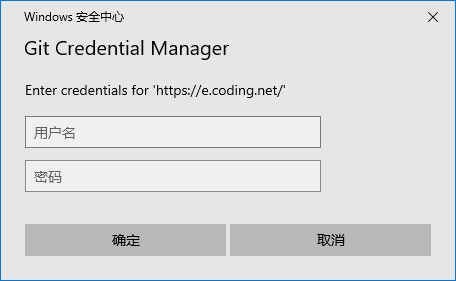

# 服务器自驾流程

## 需要软件
- **docker** [网页下载](https://www.docker.com/get-started)或者访问[share/Software/Docker](nas.diandian.info/Software/Docker/)安装
- **git** [网页下载](https://tortoisegit.org)或者访问[share/Software/Git](nas.diandian.info/Software/Docker/)安装，windows下需要安装`Git-2.30.0-64-bit.exe`、`TortoiseGit-2.11.0.0-64bit.msi`、`TortoiseGit-LanguagePack-2.11.0.0-64bit-zh_CN.msi`

### 安装过程
1. docker
   * 在nas中安装对应系统的docker软件，安装完成后会提示重启: 
   * 重启系统后会自动运行docker，第一次运行时如果出现以下提示时需要在`nas/Software/WSL/`中安装`wsl_update_x64.msi`: 
    
    

2. git
   * 在nas中安装`nas/Software/Git/Git-2.30.0-64-bit.exe`，一路默认配置就行
   * 在nas中安装`nas/Software/Git/TortoiseGit-2.11.0.0-64bit.msi`，一路默认配置，如果想用中文在遇到语言选择的ui时先安装`nas/Software/Git/TortoiseGit-LanguagePack-2.11.0.0-64bit-zh_CN.msi`语言包，然后点击`refresh`按钮刷新后就能选择中文，之后一路默认配置
    
    
   * TortoiseGit自动安装最后会运行首次配置向导，在此输入自己名字和邮箱地址，这个是作为git提交信息
    
   
----------------------

## 开启服务
1. 安装git后，在当前目录进入windows命令行或者mac终端，然后分别执行下面两条命令

    ```
    git clone https://e.coding.net/mmstudio/blade/server_bin.git server

    docker plugin install grafana/loki-docker-driver:latest --alias loki --grant-all-permissions
    ```

    > 在首次执行`git clone`命令时会要求输入`coding.net`的账户和密码 

2. 进入`server`目录中进行服务器相关脚本操作

    * 开启服务器

        mac系统在目录下执行命令`./start_mac.sh`，win系统在目录下运行脚本`start_win.bat`
        > 在首次开启服务器时，会拉取镜像包，拉取的时候也需要输入一次`coding.net`的账号密码 

        拉取完服务器后会自动开启服务，首次开启时会有`docker`映射磁盘的提示 

        一切完毕后提示success，服务器即开启成功，可以运行测试客户端`apps/client/client.exe`来测试是否能和服务器通信，测试客户端使用jk作为上下方向键，回车选中命令

    * 关闭服务器
     
        mac系统在目录下执行命令`./stop_mac.sh`，win系统在目录下运行脚本`stop_win.bat`

    * 更新服务器

        mac系统在目录下执行命令`./update_mac.sh`，win系统在目录下运行脚本`update_win.bat`

